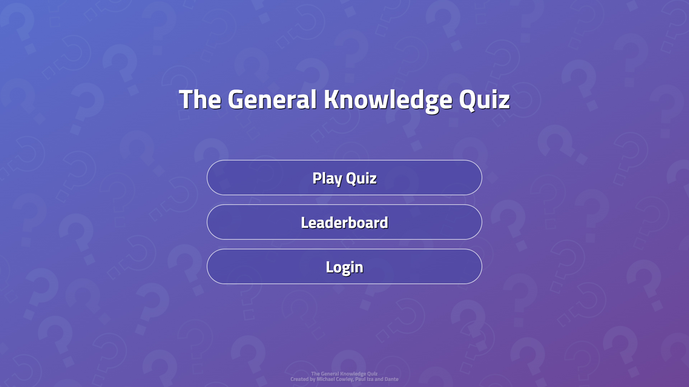
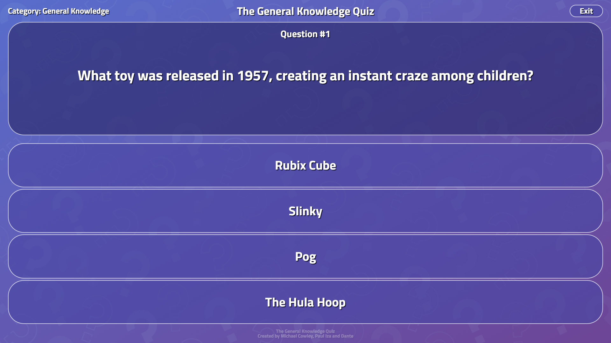
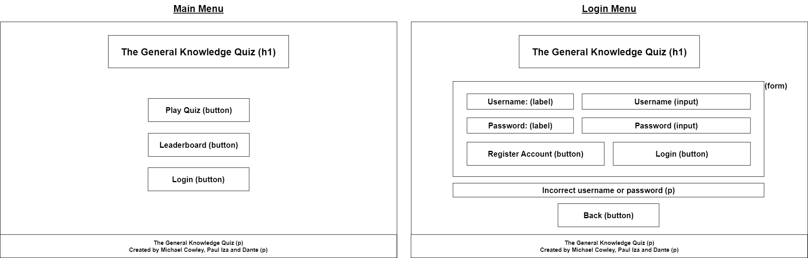
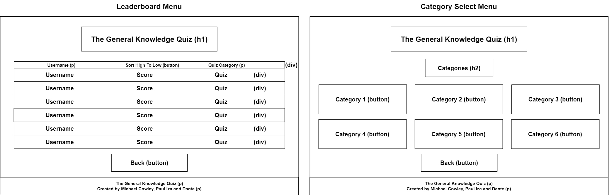
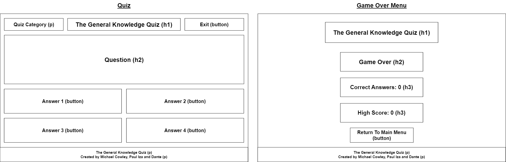

# The General Knowledge Quiz

The project is deployed on Render and can be viewed [here](https://the-general-knowledge-quiz.onrender.com/).

## Team members and project management

#### Contributors:

- Michael Cowley
- Paul Iza
- Dante

#### Project management:

- **Trello:** We created a [Trello board](https://trello.com/b/VLkG0dts/the-general-knowledge-quiz) to organise tasks and monitor our progress throughout development.
- **Shared Programming:** We utilised shared programming to collaborate on code development in real-time, ensuring all team members were involved and encourage sharing of knowledge.
- **Git Branches:** We frequently used Git branches to push code changes so we could all access the latest code additions and collaborate seamlessly.

## About the project

The General Knowledge Quiz offers an opportunity to challenge and expand your general knowledge across a diverse range of categories including film and TV, sports, music, geography, and history. This quiz provides an engaging and fun learning platform for all players.

The quiz interacts with an API to fetch questions from a large database to provide endless replayability.

To maintain player engagement, the quiz tracks high scores for logged-in users, allowing them to compete for top spots on the leaderboard and surpass their high scores.

## Wireframes

We produced wireframes at the start of the project to plan the layout and content of each page. The design of some pages were slightly modified during development to incorporate new ideas and achieve the most appealing design possible.

## User stories and problem domain

#### Project aim:

The aim of this project was to collaborate as a team and create a full stack web application that interacts with an API and database. Furthermore, the project encouraged strong JavaScript programming and CSS styling to develop an appealing and interactive user interface.

#### User stories:

- As a user, I want to be able to give an answer to a question that has been fetched from an API.
- As a user, I want to be able to select the category of questions to be fetched and displayed from the API.
- As a user, I want the website to have an appealing and interactive design, suitable for all devices.
- As a user, I want to be able to login or create an account with a username and password. The data is stored in a database so I can login using the same details in a new session.
- As a user, I want to be able to view high scores achieved by other users. The data is stored in a database so all users can share and view the same high scores in a global leaderboard.

#### Future additions:

- Enhance the quiz experience by allowing users to select the difficulty and access abilities such as 50/50 or hints.
- Introduce additional quiz modes such as timed challenges and limited lives for increased playability.
- Allow users to sort the leaderboard by high scores for each quiz.
- Make passwords and data storage secure to ensure user information is protected.

## Installation

#### Dependencies:

- [Better-sqlite3](https://www.npmjs.com/package/better-sqlite3)
- [Cors](https://www.npmjs.com/package/cors)
- [Dotenv](https://www.npmjs.com/package/dotenv)
- [Express](https://expressjs.com/)
- [Vite](https://vitejs.dev/)

#### To install and setup the project with the required dependencies:

- Clone the repository: `git clone git@github.com:Mike7704/the-general-knowledge-quiz.git`
- Navigate into the project directory and create a client folder by running `npm create vite@latest`, then initialise it using `npm i`.
- Navigate back into the project directory and create a server folder. Install the required dependencies by running `npm i express cors better-sqlite3 dotenv`.

## References

- [The Trivia API](https://the-trivia-api.com/)
- [Favicon](https://www.vecteezy.com/free-vector)
- [Google fonts](https://fonts.google.com/)
- [Background image](https://www.freepik.com/)
